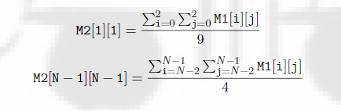
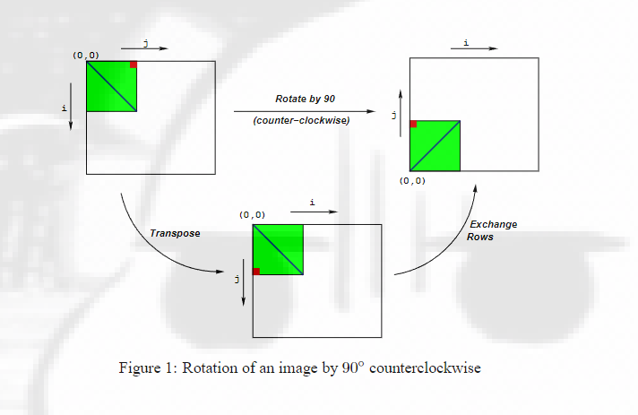
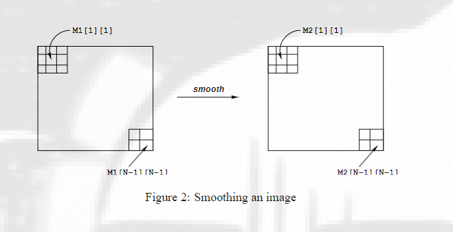
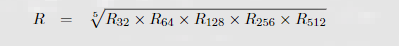
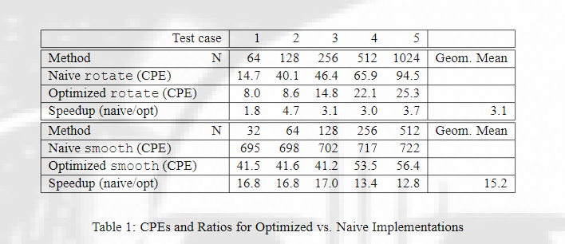
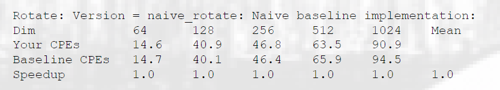
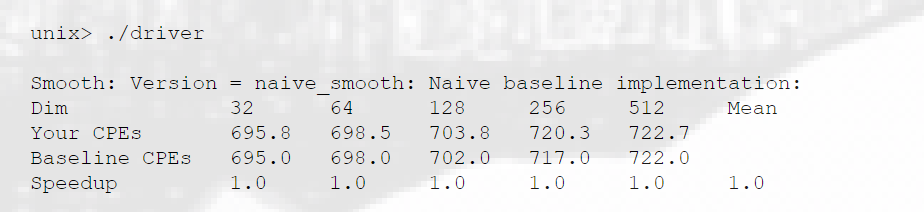

### 实验任务 L4：代码优化
课程：CS 213, Fall 2001
布置日期：2021年10月11日
截止日期：2021年10月25日，晚上11:59
负责人：Sanjit Seshia (sanjit+213@cs.cmu.edu)

### 1. 引言
本次实验任务涉及优化内存密集型代码。图像处理提供了许多可以从优化中受益的函数示例。在本次实验中，我们将考虑两种图像处理操作：旋转（rotate）和模糊（smooth）。

旋转：将图像逆时针旋转90°。
模糊：对图像进行“平滑”或“模糊”处理。

在这个实验中我们将图像表示为一个二维矩阵M，其中Mi,j表示M中第(i, j)个像素的值。像素值是红、绿、蓝（RGB）值的三元组。我们只考虑方形图像。设N为图像的行数（或列数）。行和列的编号采用C语言风格，从0到N-1。

给定这种表示方式，旋转操作可以通过以下两个矩阵操作的组合来实现：
转置：对于每一对(i, j)，交换M[i][j]和M[j][i]。
交换行：将第i行与第N-1-i行交换。

这种组合在图1中进行了说明。
模糊操作通过将每个像素值替换为其周围所有像素的平均值（以该像素为中心的最大3×3窗口）来实现。图2展示了像素M2[1][1]和M2[N-1][N-1]的值计算方式。




图1：图像逆时针旋转90°

图2：图像模糊操作


### 2. 实验安排
你可以与最多两人一组共同完成本次实验任务。唯一的提交方式是电子提交。任何澄清或对实验任务的修订都将发布在课程网页上。

### 3. 实验说明

  ## 特定于站点：在此插入一段话，解释教师如何将perflab-handout.tar文件分发给学生。

首先，将perflab-handout.tar复制到你计划进行工作的受保护目录中。然后执行以下命令：tar xvf perflab-handout.tar。这将解压多个文件到目录中。你唯一需要修改并提交的文件是kernels.c。driver.c程序是一个驱动程序，允许你评估解决方案的性能。使用命令make driver生成驱动代码，并使用命令./driver运行它。

查看文件kernels.c，你会注意到一个C语言结构体team，你应该在其中插入关于编程团队的一或两个人的识别信息。请立即完成此操作，以免遗忘。

### 4. 实现概述

## 数据结构
核心数据结构涉及图像表示。像素是一个结构体，如下所示：

```c
typedef struct {
    unsigned short red;   /* R值 */
    unsigned short green; /* G值 */
    unsigned short blue;  /* B值 */
} pixel;
```

如上所示，RGB值具有16位表示（“16位颜色”）。图像I表示为一个像素的一维数组，其中第(i, j)个像素是I[RIDX(i, j, n)]。这里n是图像矩阵的维度，RIDX是一个宏，定义如下：

```c
#define RIDX(i, j, n) ((i)*(n)+(j))
```

请参阅文件defs.h以获取此代码。

## 旋转
以下C函数计算将源图像src旋转90°的结果，并将结果存储在目标图像dst中。dim是图像的维度。

```c
void naive_rotate(int dim, pixel *src, pixel *dst) {
    int i, j;
    for (i = 0; i < dim; i++)
        for (j = 0; j < dim; j++)
            dst[RIDX(dim - 1 - j, i, dim)] = src[RIDX(i, j, dim)];
    return;
}
```

上述代码扫描源图像矩阵的行，并将它们复制到目标图像矩阵的列中。你的任务是使用诸如代码移动、循环展开和分块等技术重写此代码，使其运行尽可能快。
请参阅文件kernels.c以获取此代码。

## 模糊
模糊函数接受一个源图像src作为输入，并将模糊结果返回到目标图像dst中。以下是部分实现：

```c
void naive_smooth(int dim, pixel *src, pixel *dst) {
    int i, j;
    for (i = 0; i < dim; i++)
        for (j = 0; j < dim; j++)
            dst[RIDX(i, j, dim)] = avg(dim, i, j, src); /* 平滑第(i, j)个像素 */
    return;
}
```

函数avg返回第(i, j)个像素周围所有像素的平均值。你的任务是优化smooth（和avg）函数，使其运行尽可能快。（注意：avg函数是一个本地函数，你可以完全摆脱它，以其他方式实现smooth。）
此代码（以及avg函数的实现）在文件kernels.c中。

### 性能指标

我们的主要性能指标是CPE（每元素周期数）。如果一个函数处理大小为N×N的图像需要C个周期，则CPE值为C/N²。表1总结了上述朴素实现的性能，并与优化实现进行了比较。性能展示了5个不同的N值。所有测量均在Pentium III Xeon Fish机器上进行。
优化实现与朴素实现的比率（加速比）将构成你实现的评分。为了总结不同N值的整体效果，我们将计算这5个值的几何平均值。也就是说，如果N = {32, 64, 128, 256, 512}的测量加速比分别为R32、R64、R128、R256和R512，则我们计算整体性能为：
                  


表1：优化实现与朴素实现的CPE和比率

## 假设
为了简化问题，你可以假设N是32的倍数。你的代码必须对所有这样的N值正确运行，但我们仅测量表1中显示的5个值的性能。

### 5. 基础设施
我们提供了支持代码，帮助你测试实现的正确性和测量性能。本节描述如何使用此基础设施。实验任务的每个部分的详细信息在以下部分中描述。
注意：你唯一需要修改的源文件是kernels.c。

## 版本管理
你将编写许多版本的旋转和模糊例程。为了帮助你比较编写的所有不同版本的性能，我们提供了一种“注册”函数的方法。
例如，我们提供的kernels.c文件包含以下函数：

```c
void register_rotate_functions() {
    add_rotate_function(&rotate, rotate_descr);
}
```

此函数包含一个或多个add_rotate_function调用。在上述示例中，add_rotate_function注册了函数rotate以及描述该函数的ASCII字符串rotate_descr。请参阅文件kernels.c以了解如何创建字符串描述。此字符串最多可以有256个字符。
kernels.c文件中还提供了你的模糊内核的类似函数。

## 驱动程序
你编写的源代码将与我们提供的目标代码链接成一个驱动二进制文件。要创建此二进制文件，需要执行以下命令：

```bash
make driver
```

每次修改kernels.c中的代码时，都需要重新生成驱动程序。要测试你的实现，可以运行以下命令：

```bash
./driver
```

驱动程序可以以四种不同的模式运行：
默认模式：运行所有版本的实现。
自动评分模式：仅运行rotate()和smooth()函数。这是我们使用驱动程序评分时的模式。
文件模式：仅运行输入文件中提到的版本。
转储模式：将每个版本的一行描述转储到文本文件中。可以编辑此文本文件，仅保留要使用文件模式测试的版本。可以指定是否在转储文件后退出。
如果没有任何参数运行driver，它将以默认模式运行所有版本。其他模式和选项可以通过命令行参数指定，如下所示：
-g：仅运行rotate()和smooth()函数（自动评分模式）。
-f <funcfile>：仅执行<funcfile>中指定的版本（文件模式）。
-d <dumpfile>：将所有版本的名称转储到名为<dumpfile>的转储文件中，每行一个版本（转储模式）。
-q：在转储版本名称到转储文件后退出。与-d一起使用。例如，要立即退出，请输入./driver -qd dumpfile。
-h：打印命令行用法。

## 团队信息
重要：在开始之前，应填写kernels.c中的结构体，包含关于你的团队的信息（组名、团队成员姓名和电子邮件地址）。这些信息与数据实验室中的信息相同。

### 6. 实验任务详情
## 优化旋转（50分）
在这一部分，你需要优化rotate函数，使其CPE尽可能低。应编译driver并使用适当的参数运行它来测试实现。
例如，使用提供的朴素版本（rotate）运行driver会生成以下输出：
```bash
unix> ./driver
Teamname: bovik
Member 1: Harry Q. Bovik
Email 1: bovik@nowhere.edu
```


## 优化模糊（50分）
在这一部分，你需要优化smooth函数，使其CPE尽可能低。
例如，使用提供的朴素版本（smooth）运行driver会生成以下输出：


## 一些建议
查看rotate和smooth生成的汇编代码。专注于使用课堂上讲授的优化技巧优化内循环（在循环中反复执行的代码）。smooth函数更具计算密集性，对内存的敏感性较低，因此优化方式有所不同。

## 编码规则
你可以编写任何代码，只要满足以下条件：
必须是ANSI C。不能使用任何嵌入的汇编语言语句。
不能干扰时间测量机制。如果你的代码打印任何多余的信息，也将被扣分。
只能修改kernels.c中的代码。允许在此文件中定义宏、其他全局变量和其他过程。

## 评估
rotate和smooth的解决方案将各占50%的分数。每个部分的评分基于以下标准：
正确性：如果代码有错误导致驱动程序抱怨，将不给予任何分数！这包括在测试大小上正确运行但在其他大小的图像矩阵上运行错误的代码。如前所述，你可以假设图像维度是32的倍数。
CPE：如果实现正确并且平均CPE超过阈值Sr和Ss，将给予满分。对于比提供的朴素实现更好的正确实现，将给予部分分数。

  ## 特定于站点：作为教师，你需要决定满分阈值Sr和Ss以及部分分数的规则。我们通常使用线性比例，如果学生实际尝试解决实验任务，最低分数约为40%。

### 7. 提交说明

  ## 特定于站点：在此插入一段话，告诉每个团队如何提交他们的kernels.c文件。例如，以下是我们在CMU使用的提交说明。

完成实验后，你将提交一个包含解决方案的文件kernels.c。以下是提交解决方案的方法：
确保已在kernels.c中的team结构体中包含识别信息。
确保rotate()和smooth()函数对应于你最快的实现，因为这些是我们在评分时唯一测试的函数。
删除任何多余的打印语句。
创建一个团队名称，格式如下：
“ID”，如果你独自工作，其中ID是你的Andrew ID，或者
“ID1+ID2”，其中ID1是第一个团队成员的Andrew ID，ID2是第二个团队成员的Andrew ID。
为提交你的kernels.c文件，输入以下命令：

```bash
make handin TEAM=teamname
```

其中teamname是上述描述的团队名称。
如果在提交后发现错误并想提交修订版，输入以下命令：

```bash
make handin TEAM=teamname VERSION=2
```

每次提交时递增版本号。
你可以通过查看以下目录来验证提交：

```bash
/afs/cs.cmu.edu/academic/class/15213-f01/L1/handin
```

你在此目录中有列出和插入权限，但没有读取或写入权限。
祝你好运！