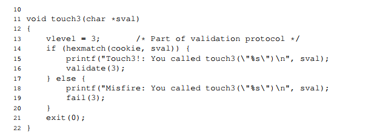

此作业涉及对具有不同安全漏洞的两个程序生成总共五次攻击。
您将从此实验室获得的成果包括：

  您将了解当程序不能很好地保护自己免受缓冲区溢出时，攻击者可以利用安全漏洞的不同方式。

  通过这个，您将更好地了解如何编写更安全的程序，以及编译器和操作系统提供的一些功能，以使程序不那么容易受到攻击。

  您将更深入地了解 x86-64 机器代码的堆栈和参数传递机制。

  您将更深入地了解 x86-64 指令的编码方式。

  您将获得更多使用 GDB 和 OBJDUMP 等调试工具的经验。

注意：在本练习中，您将获得有关利用操作系统和网络服务器中安全漏洞的方法的第一手经验。
我们的目的是帮助您了解程序的运行时操作，并了解这些安全漏洞的性质，
以便您在编写系统代码时可以避免它们。我们绝不容忍使用任何其他形式的攻击来未经授权访问任何系统资源

您将需要学习 CS：APP3e 书籍的第 3.10.3 节和第 3.10.4 节，作为本实验的参考资料。

像往常一样，这是一个单独的项目。您将为目标程序生成为您定制的攻击。

您可以通过将 Web 浏览器指向以下位置来获取文件： http://$Attacklab::SERVER_NAME:15513/
INSTRUCTOR： $Attacklab：：SERVER_NAME 是运行 attacklab 服务器的机器。
您可以在 attacklab/Attacklab.pm 和 attacklab/src/build/driverhdrs.h 中定义它服务器将构建您的文件，
并在名为 targetk.tar 的 tar 文件中将它们返回给您的浏览器，其中 k 是目标程序的唯一编号

注意：构建和下载目标需要几秒钟时间，因此请耐心等待。将 targetk.tar 文件保存在您计划执行工作的 （受保护） Linux 目录中。
然后给出命令：tar-xvf targetk.tar。这将提取包含下述文件的目录 targetk。

您应该只下载一组文件。如果出于某种原因您下载了多个目标，请选择一个目标并删除其余目标。
警告：如果您在 PC 上通过使用 Winzip 等实用程序扩展targetk.tar，或者让浏览器执行提取，您将面临重置可执行文件的权限位的风险。

targetk 中的文件包括：
  README.txt：描述目录内容的文件
  ctarget：易受代码注入攻击的可执行程序
  rtarget：易受面向返回的编程攻击的可执行程序
  cookie.txt：一个 8 位十六进制代码，您将用作攻击中的唯一标识符。
  farm.c：目标的“小工具农场”的源代码，您将使用它来生成面向返回的编程攻击。
  hex2raw：用于生成攻击字符串的实用程序。

在以下说明中，我们将假定您已将文件复制到受保护的本地目录，并且您正在该本地目录中执行程序

这里总结了一些关于有效解决方案的重要规则，
当您第一次阅读本文档时，这些要点不会有太大意义。
但在你开始之后，它们在这里作为主要的参考规则。

  您必须在一台机器上做任务，这与生成您的目标的机器相似

  您的解决方案不得使用攻击来规避程序中的验证代码。

  具体而言，您合并到攻击字符串中以供 ret 指令使用的任何地址都应指向以下目的地之一：

    函数touch1、touch2、或 touch3 的地址。

    你插入的代码的地址

    Gadget 农场中某个 Gadget 的地址。

您只能从文件 rtarget 构造 Gadgets，其地址范围介于函数 start_farm 和 end_farm 之间

CTARGET 和 RTARGET 都是从标准输入中读入字符串的。他们使用 getbuf 函数。
定义如下：
  unsigned getbuf()
  {
    char buf[BUFFER_SIZE];
    Gets(buf);
    return 1;
  }

Gets函数类似于标准库函数 gets -- 他从标准输入中读入一个字符串（以'\n'或者EOF结尾）
然后把它存入一个给定的目的地（结尾有一个'\0'）。在这个代码中，你可以看到目标是一个 buf 数组，
其声明大小为 BUFFER_SIZE 字节。在这个时候，你的目标会被生成， BUFFER_SIZE 是一个给定的编译期常量
对于你的程序的版本。

函数 Gets 和 gets 没有办法确认他们的目标缓冲区是否足够大来存储他们所读入的字符串。
他们简单的复制字符序列， 可能会超过目的地所分配的存储界限。

如果用户输入的并被 getbuf 函数读入的字符串是足够的短的话，那么显然 getbuf 函数会返回 1
就像下面所演示的一样：

  unix> ./ctarget
  Cookie: 0x1a7dd803
  Type string: Keep it short!
  No exploit. Getbuf returned 0x1
  Normal return

通常情况下，如果你输入一个过长的字符串，会出现一个错误：

    unix> ./ctarget
    Cookie: 0x1a7dd803
    Type string: This is not a very interesting string, but it has the property ...
    Ouch!: You caused a segmentation fault!
    Better luck next time

(注意，展示出的cookie的值和你的不同)RTARGET程序会有相同的行为。正如错误信息所显示的，
超过缓冲池通常会造成程序状态被中断，导入一个错误的内存地址。你的任务就是给 CTARGET 和 RTARGET
喂入有趣的字符串，做出有趣的事情。这些字符串被称为 exploit(有效) 字符串

CTARGET 和 RTARGET 任务都有七个不同的命令：
-h : 打印可能的命令
-q : 不要把结果送给评分服务器
-i FILE : 从一个文件中读入，而不是标准输入

您的 exploit 字符串通常包含与用于打印字符的 ASCII 值不对应的字节值。
程序 HEX2RAW 将使您能够生成这些原始字符串。有关如何使用 HEX2RAW 的更多信息，请参阅附录 A。

重要的点：
  您的利用字符串不得包含任何中间位置的字节值0x0a，因为这是换行符 （'n'） 的 ASCII 码。
  当 Gets 遇到此字节时，它将假定你打算终止字符串。

  HEX2RAW 需要两位数的十六进制值，由一个或多个空格分隔。
  因此，如果要创建十六进制值为 0 的字节，则需要将其写入 00。
  要创建单词 0xdeadbeef您应该将 “ef be ad de” 传递给 HEX2RAW （请注意 little-endian 字节排序所需的反转）。

当您正确解决了其中一个级别时，您的目标程序将自动向评分服务器发送通知。例如：
 unix> ./hex2raw < ctarget.l2.txt | ./ctarget
 Cookie: 0x1a7dd803
 Type string:Touch2!: You called touch2(0x1a7dd803)
 Valid solution for level 2 with target ctarget
 PASSED: Sent exploit string to server to be validated.
 NICE JOB

  

服务器将测试您的漏洞利用字符串以确保它确实有效，并将更新 Attacklab 记分板页面，表明您的用户 ID（为您的目标编号列出以供匿名列出）已完成此阶段。您可以通过将 Web 浏览器指向:
 http://$Attacklab::SERVER_NAME:15513/scoreboard

与 Bomb Lab 不同，在这个实验室中犯错不会受到处罚。随意使用您喜欢的任何字符串来使用 CTARGET 和 RTARGET。重要说明：您可以在任何 Linux 计算机上处理您的解决方案，但要提交您的解决方案，您需要在以下计算机之一上运行：
 INSTRUCTOR: Insert the list of the legal domain names that you
 established in buflab/src/config.c.

figure 1 总结了实验室的五个阶段。可以看出，前三个涉及对 CTARGET 的代码注入 （CI） 攻击，而后两个涉及对 RTARGET 的面向返回编程 （ROP） 攻击。

第一部分：代码注入攻击
  在前三个阶段，您的漏洞利用字符串将攻击 CTARGET。该程序的设置方式使堆栈位置从一次运行到下一次运行保持一致，因此堆栈上的数据可以被视为可执行代码。这些功能使程序容易受到攻击，其中利用字符串包含可执行代码的字节编码。

  LEVEL 1 :
    对于阶段 1，您不会注入新代码。相反，您的 exploit 字符串将重定向程序以执行现有过程。

    函数 getbuf 在 CTARGET 中由具有以下 C 代码的函数 test 调用 :

    void test()
    {
      int val;
      val = getbuf();
      printf("No exploit. GetBuf returned 0x%x\n", val);
    }

    当 getbuf 执行他的返回语句的时候， 程序通常在函数 test 中恢复执行
    我们想改变这种行为。在文件 ctarget 中，有一个函数 touch1 的代码，其 C 表示形式如下：

    void touch1()
    {
      vlevel = 1;
      printf("Touch1!: You called touch1()\n");
      validate(1);
      exit(0);
    }

    你的任务是让 CTARGET 执行 touch1 的代码，当 getbuf 执行返回语句的时候。而不是去正确的返回 test 函数体。请注意，您的利用字符串还可能会损坏堆栈中与此阶段没有直接关系的部分，但这不会导致问题 ，因为 touch1 会导致程序直接退出。

    一些建议：
      • 通过检查 CTARGET 的反汇编版本，可以确定为此级别设计漏洞利用字符串所需的所有信息。使用 objdump -d 获取此拆解版本。
      • 这个想法是定位 touch1 的起始地址的字节表示形式，以便 ret GETBUF 代码末尾的指令将控制权转移给 touch1。
      • 注意字节排序。
      • 您可能希望使用 GDB 逐步执行程序，完成 getbuf 的最后几条指令, 当然，它正在做正确的事情。
      • buf 在 getbuf 的堆栈帧中的位置取决于 compile-time 的值 constant BUFFER_SIZE，以及 GCC 使用的分配策略。您需要检查反汇编代码来确定其位置。

  LEVEL 2 :
    第 2 阶段涉及注入少量代码作为漏洞利用字符串的一部分。
    在文件 ctarget 中，有一个函数 touch2 的代码，其 C 表示形式如下：
    void touch2(unsigned val)
    {
      vlevel = 2;
      if (val == cookie) {
        printf("Touch2!: You called touch2(0x%.8x)\n", val);
      } else {
        printf("Misfire: You called touch2(0x%.8x)\n", val);
        fail(2);
      }
      exit(0);
    }

    您的任务是让 CTARGET 执行 touch2 的代码，而不是返回 test。在这种情况下，但是，您必须使其在 touch2 中看起来就像您已将 Cookie 作为其参数传递一样。

    一些建议：
      • 您需要以这样一种方式定位注入代码地址的字节表示形式getbuf 代码末尾的 ret 指令将控制权转移给它。
      • 回想一下，函数的第一个参数是在寄存器 %rdi 中传递的。
      • 您注入的代码应该将 register 设置为您的 cookie，然后使用 ret 指令进行传输 control 到 touch2 中的第一条指令。
      • 请勿尝试在漏洞利用代码中使用 jmp 或 call 指令destination 的编码,这些说明的地址很难制定。使用 ret 指令进行所有控制，即使您没有从呼叫中返回。
      • 请参阅附录 B 中有关如何使用工具生成指令序列。

  LEVEL 3 :
    阶段 3 还涉及代码注入攻击，但将字符串作为参数传递。在文件 ctarget 中，有函数 hexmatch 和 touch3 的代码，其 C 语言如下:
    
    
    您的任务是让 CTARGET 执行 touch3 的代码，而不是返回 test。您必须使其在 touch3 中看起来就像您已将 cookie 的字符串表示形式作为其参数传递一样。

    一些建议：
      • 您需要在漏洞利用字符串中包含 Cookie 的字符串表示形式。字符串应由 8 个十六进制数字 （从最高有效到最低有效） 组成，没有前导 “0x”。
      • 回想一下，字符串在 C 中表示为字节序列，后跟值为 0 的字节。类型“man ascii” 来查看所需字符的字节表示形式。
      • 您注入的代码应将 register %rdi 设置为此字符串的地址。
      • 当调用函数 hexmatch 和 strncmp 时，它们会将数据推送到堆栈上，从而覆盖保存 getbuf 使用的缓冲区的内存部分。因此，您需要小心放置 Cookie 的字符串表示的位置

第二部分： 面向返回编程
  对程序 RTARGET 执行代码注入攻击比对 CTARGET 执行要困难得多。因为它使用两种技术来阻止此类攻击：
    • 它使用随机化，以便堆栈位置在每次运行中都不同。这使得无法确定注入的代码将位于何处。
    • 它将保存堆栈的内存部分标记为不可执行，因此，即使您可以将program 与注入的代码的开头相反，程序将失败并出现segment fault。
  幸运的是，聪明的人已经设计出了策略，通过执行
  现有代码，而不是注入新代码。最一般的形式称为 return-oriented编程 （ROP） [1， 2]。
  ROP 的策略是识别现有程序中的字节序列，由一个或多个指令组成，后跟指令 ret.此类段称为 gadget.
  
  figure 2 说明了如何设置堆栈以执行 n 个 gadget 序列。在此图中，stack 包含一系列 Gadget 地址。每个 Gadget 都由一系列指令字节组成，其中最后一个是 0xc3，对 ret 指令进行编码。当程序执行 ret 指令时，启动使用此配置，它将启动一系列 Gadget 执行，其中 ret 指令位于每个 Gadget 都会导致程序跳转到下一个 Gadget 的开头。

  Gadget 可以使用与编译器生成的汇编语言语句相对应的代码。尤其是函数末尾的 Cookie。在实践中，可能有一些这种形式的有用小工具，但不是足以实现许多重要操作。例如，编译后的函数将 popq %rdi 作为其 ret 之前的最后一条指令。幸运的是，使用面向字节的指令set（例如 x86-64）中，通常可以通过从指令的其他部分提取模式来找到 gadget字节序列。

  例如，rtarget 的一个版本包含为以下 C 函数生成的代码：

  

  此功能对攻击系统有用的机会似乎非常渺茫。但是，拆解的此函数的机器代码显示了一个有趣的字节序列：

  

  字节序列 48 89 c7 编码指令 movq %rax， %rdi。（有关有用的 movq 指令的编码，请参阅图 3A。此序列后跟字节值 c3，用于编码 ret 指令。该函数从地址 0x400f15 开始，序列从 的第四个字节开始函数。因此，此代码包含一个起始地址为 0x400f18 的小工具，它将寄存器 %rax 中的 64 位值复制到寄存器 %rdi。

  RTARGET 的代码包含许多函数，这些函数类似于上面显示的 setval_210 函数，该函数位于我们称为 Gadget 场的区域。您的工作是在小工具农场中识别有用的小工具，并且使用这些来执行类似于您在第 2 阶段和第 3 阶段中所做的攻击。

  重要说明：Gadget 场由 rtarget 副本中的 start_farm 和 end_farm 函数划分。不要尝试从程序代码的其他部分构造 Gadget

  LEVEL2 :
    对于第 4 阶段，您将重复第 2 阶段的攻击，但使用小工具农场中的小工具对程序 RTARGET 进行重复。您可以使用由以下指令类型组成的 gadget 构建您的解决方案：并且仅使用前 8 个 x86-64 寄存器 （%rax–%rdi）。

    movq ： 这些代码如图 3A 所示。
    popq ：这些代码如图 3B 所示。
    ret ： 该指令由单字节0xc3编码。
    nop ：这条指令（发音为“no op”，是 “no operation” 的缩写）由单个字节0x90。它的唯一效果是使程序计数器增加 1。

    一些建议：
      • 您需要的所有小工具都可以在由函数 start_farm 和 mid_farm 划分的 rtarget 代码区域中找到。
    • 您只需两个小工具即可进行此攻击。
    • 当 Gadget 使用 popq 指令时，它将从堆栈中弹出数据。因此，您的漏洞利用字符串将包含 Gadget 地址和数据的组合。

  LEVEL 3:
    在开始第 5 阶段之前，请停下来考虑一下您到目前为止已经完成的工作。在阶段 2 和 3 中，您使一个程序执行您自己设计的机器代码。如果 CTARGET 是一个网络服务器，你可以将自己的代码注入到远程机器中。在第 4 阶段中，您绕过了现代系统用来阻止缓冲区溢出攻击的主要设备。尽管您没有注入自己的代码，但您能够注入一种通过将现有代码序列拼接在一起来运行的程序。您在实验室中也获得了 95/100 分。这是一个不错的分数。如果您有其他紧迫的义务，请考虑立即停止。

    阶段 5 要求您对 RTARGET 执行 ROP 攻击，以使用指向 Cookie 的字符串表示形式的指针调用函数 touch3。这似乎并不比使用 ROP 攻击调用 touch2 困难得多，只是我们已经这样做了。此外，第 5 阶段只占 5 分，这并不是衡量它所需努力的真正标准。对于那些想要超出对课程的正常期望的人来说，这更像是一个额外的学分问题。

  

    要解决第 5 阶段，您可以在 rtarget 中由函数 start_farm 和 end_farm 划分的代码区域中使用 gadgets。除了阶段 4 中使用的小工具外，这个扩展的场还包括不同 movl 指令的编码，如图 3C 所示。这部分 farm 中的字节序列还包含 2 字节的指令，这些指令用作功能 nops，即它们不会更改任何 register 或 memory 值。这些指令包括图 3D 中所示的指令，例如 andb %al，%al，它们对某些 registers 的低位字节进行操作，但不改变它们的值。

    一些建议：
      • 您需要查看 movl 指令对寄存器上 4 个字节的影响，按原样在正文第 183 页描述。
      • 官方解决方案需要八个小工具（并非所有小工具都是唯一的）。

附录：

A 使用 HEX2RAW:
  HEX2RAW 将十六进制格式的字符串作为输入。在此格式中，每个字节值由两个十六进制数字表示。例如，字符串 “012345” 可以以十六进制格式输入为 “30 31 32 33 34 35 00”。（回想一下，十进制数字 x 的 ASCII 码是 0x3x，字符串的结尾由 null 字节表示。

  您传递给 HEX2RAW 的十六进制字符应由空格（空格或换行符）分隔。我们建议您在处理 exploit 字符串时用换行符分隔它的不同部分。HEX2RAW 支持 C 样式的块注释，因此您可以标记漏洞利用字符串的各个部分。例如：
  
  请务必在开始和结束注释字符串（“/*”、“*/”）周围留出空间，以便正确忽略注释。
  如果您在文件exploit.txt中生成十六进制格式的漏洞利用字符串，则可以通过多种不同的方式将原始字符串应用于 CTARGET 或 RTARGET：
  
  This approach can also be used when running from within GDB
  

B 生成字节码:
  使用 GCC 作为汇编器，使用 OBJDUMP 作为反汇编器，可以方便地生成指令序列的字节码。例如，假设您编写了一个包含以下汇编代码的文件 example.s：
  
  代码可以包含指令和数据的组合。“#”字符右侧的任何内容都是注释。
  您现在可以组装和反汇编此文件：
  
  生成出来的 example.d 包含如下内容：
  

  底部的行显示了从汇编语言指令生成的机器代码。每行左侧有一个十六进制数字，表示指令的起始地址（从 0 开始），而 '：“ 字符后面的十六进制数字表示指令的字节码。因此，我们可以看到指令 push $0xABCDEF 具有十六进制格式的字节码 68 ef cd ab 00。从此文件中，您可以获取代码的字节序列：
  
  然后可以通过 HEX2RAW 传递此字符串，为目标程序生成输入字符串。或者，您可以编辑 example.d 以省略多余的值并包含 C 样式的注释以提高可读性，从而产生 ：
  
  这也是在发送到其中一个目标程序之前可以通过 HEX2RAW 传递的有效输入。

